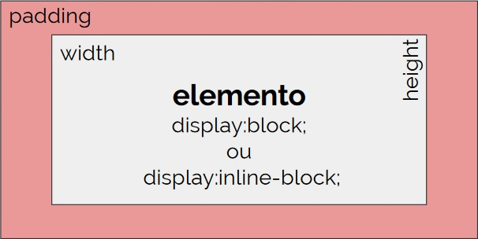
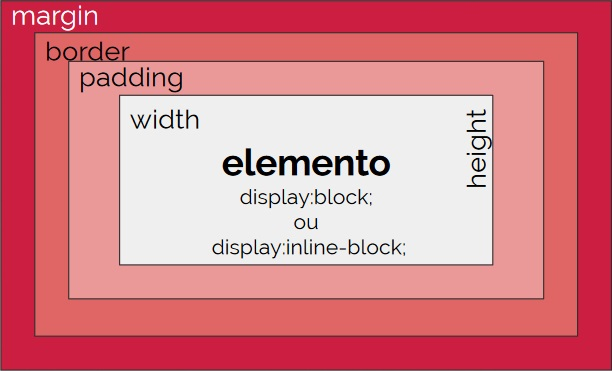
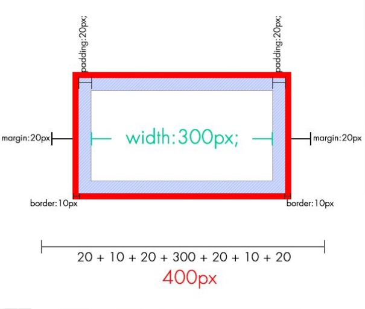
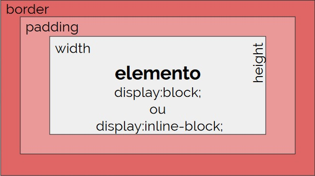

# HTML + CSS

[HTML](#aulaHTML)\
- [Elemento HTML](#elemento-html)
- [Atributos](#atributos)
- [Estrutura básica do HTML](#estrutura)
- [Indentação](#indentacao)
- [Hierarquia](#hierarquia)
- [HTML Semântico](#html-semantico)
- [Tags](#tags)
- [Tipos de display](#tipos-de-display)
	
[CSS](#aulaCSS)\
**[Estudos Extras](#estudosExtras)**\
**[Anotações de Aula](#anotacoesAula)**

---

<div id="aulaHTML"></div>

## HTML

1. Analisamos o site da [UOL](https://www.uol.com.br/) através do Chrome [DevTools](https://developers.google.com/web/tools/chrome-devtools?hl=pt-br)
2. Abrimos a aba *Elements* e inspecionamos os elementos `<html> <head> <body>`
3. Ainda na aba *Elements* o professor explicou sobre os **atributos** e sua sintaxe
4. Depois disso abrimos o bloco de notas e construimos a seguinte estrutura:

```html
<!DOCTYPE html> <!-- essa tag faz o browser entender que estamos usando o HTML5 -->
<html>
<head>
	<meta charset="UTF-8">
	<title>Meu site</title>
</head>
<body>
	<h1>Título Principal</h1>
	<h2>Subtítulo menos importante</h2>
	<h6>Título que ninguém vai ser lido por ninguém</h6>
	Olá, mundo!
	<p>Mussum Ipsum, cacilds vidis litro abertis. In elementis mé pra quem é amistosis quis leo. Tá deprimidis, eu conheço uma cachacis que pode alegrar sua vidis. Não sou faixa preta cumpadi, sou preto inteiris, inteiris. Todo mundo vê os porris que eu tomo, mas ninguém vê os tombis que eu levo!</p>
	<ol type="a">
		<li>Item 1</li>
		<li>Item 2</li>
		<li>Item 3</li>
	</ol>
</body>
</html>
```

### HTML (Hyper Text Markup Language)

HTML é uma **linguagem de marcação** que permite estruturar e apresentar conteúdo em uma página web.

Composta por **TAGs** e **ATRIBUTOS** que, por sua vez, formam **ELEMENTOS**.

*Sintaxe de uma tag:*\
`<h1 align="center"> ... </h1>` 

*Definição:*\
é um trecho de código que permite gerar um elemento visual no navegador.	

#### ELEMENTO HTML

É considerado um **elemento HTML** quando ele é formado por uma tag de abertura e outra de fechamento e o que está contido nela (seu **conteúdo**).

`<body>` tag de abertura\
`</body>` tag de fechamento

#### ATRIBUTOS 

*Definição:*\
Característica que queremos modificar de uma tag. Costuma ter vários valores ( característica que vamos modificar).

`atributo="valor"` atributo recebe o valor (ref: [Gustavo Guanabara](https://www.youtube.com/watch?v=rsFCVjr5yxc))

Nem todo atributo precisa de valor!

Alguns atributos podem ser utilizados em qualquer tag HTML, esses atributos são chamados globais, 4 deles são: `id=""`, `class=""`, `title=""` e `style=""`.

**Atributo `charset=""`**

`charset="utf-8"` atributo **conjunto de caracteres** com valor **UTF-8 (8-bit Unicode Transformation Format)**, este valor é um esquema de codificação *(character encoding)* que basicamente mapeia os **bits** (zeros e uns) em **caracteres**.

O atributo charset permite definir a codificação de caracteres a ser usada. Embora não seja obrigatório, ele deve ser incluído em qualquer documento HTML por dois motivos principais:\
1. Para evitar a exibição incorreta em alguns navegadores
2. Para seguir as convenções e padrões da W3C

[Unicode e UTF-8](https://www.ime.usp.br/~pf/algoritmos/apend/unicode.html)

**Atributo `rel=""`**

`rel=""` atributo usado apenas quando o `href=""` é referenciado, utilizado principalmente em se trantando de performance de SEO. Usada para atribuir uma relação entre o documento atual e o linkado pelo `href=""`.

[Atributo `rel=""` e seus valores](https://ferramentasseo.club/rel-nofollow-noreferrer-noopener-external)\
[Atributo `rel=""` - W3C](https://www.w3schools.com/TAGS/att_a_rel.asp)

**Atributo `title=""`**

`title=""` atributo que cria uma caixinha de título e pode ser usado com qualquer tag, é uma tag importante para rankeamento de SEO.

#### ESTRUTURA BÁSICA DO HTML

```html
<!DOCTYPE html>
	<html>
		<head>
		<meta charset=”utf-8”>
		<title> Meu site </title>
</head>
<body>
	Olá, Mundo!
</body>
</html>
```

#### INDENTAÇÃO

A [indentação](https://pt.wikipedia.org/wiki/Indenta%C3%A7%C3%A3o) de código é empregada na maioria das linguagens de programação com o objetivo de **organizar/estruturar** o **código/algoritmo**, facilitando em consequência disso a **legibilidade do código**, ou seja, tornar a interpretação do código mais fácil. Além disso,é usada para **definir a hierarquia** entre as partes do código.

#### HIERARQUIA

Se o elemento estiver dentro de uma tag de abertura e fechamento, ele estará dentro de seu pai, portanto ele será filho, ele também poderá ter irmão, se outros elementos estiverem no mesmo nível que ele.

```html
<body> <!-- tag de abertura e pai de <h1> e <p> -->
    <h1></h1> <!-- filho de body e irmão de <p> -->
    <p><p> <!-- filho de body e irmão de <h1> -->
</body> <!-- tag de fechamento -->
```

#### HTML SEMÂNTICO 

SEO é o conjunto de estratégias empregadas para potencializar e melhorar o posicionamento de um site nos mecanismos de busca. E é justamente nessa otimização que entra o **HTML semântico**, isso por que o uso de determinadas tags HTML podem reforçar o significado do conteúdo de um site. Imprescindível para SEO.

[Elementos semânticos](https://www.devmedia.com.br/html-semantico-conheca-os-elementos-semanticos-da-html5/38065)

`<em>` itálico semântico\
`<strong>` ênfase semântica\
`<mark>` texto que deverá ser realçado com fundo amarelo\
`<cite>` usada para citações\
`<abbr title="Wolrd Wide Web Consortium">W3C (Abreviação)</abbr>` para mostrar o significado das abreviações

* tags semânticas 
	- `<span>`
	- `<div>`
	- `<pre>` mais usado no **php**
	- `<section>` seção de conteúdo monotemático
	- `<article>` informações dentro de uma seção
	- `<header>` cabeçalho do conteúdo ou de um documento
	- `<footer>` rodapé do conteúdo ou de um documento

#### TAGS

##### Meta tags

Como suas informações vem por meio de atributos, ela não precisa de fechamento.

[Elemento `<meta>` - MDN](https://developer.mozilla.org/pt-BR/docs/Web/HTML/Element/meta)\
[`<meta>` TAGS](https://www.chiefofdesign.com.br/meta-tags/)

meta tag de responsividade:\
`<meta name="viewport" content="width=device-width, initial-scale=1.0">`

meta tag para compatibilidade back-end:\
`<meta http-equiv="X-UA-Compatible" content="ie=edge">`

##### Elementos de cabeçalho

Elementos de cabeçalho são implementados em seis níveis, `<h1>` é o mais importante e `<h6>` é o de menor importância, ou seja elas não definem o tamanho da fonte e sim a **importância**. Posso utilizar apenas **um** `<h1>` no meu `<html>`. `<h1>` é uma tag semântica que permite gerar títulos e subtítulos. São muito
importante para o posicionamento em buscadores.

```html
<h1> Título principal </h1>
<h2> Subtítulo </h2>
<h3> Outro subtítulo </h3>
<h4> Mais um </h4>
<h5> Outro, por que não? </h5>
<h6> Agora sim, o último </h6>
```

`<p></p>` tag para construção de parágrafo
`</br>` só pode ser usado para quebra de linhas dentro dos parágrafos
`<hr>` self-close tag para criar a linha de quebra de conteúdo

[Lorem Ipsum](https://br.lipsum.com/)

##### Elementos de listas

*Listas ordenadas:*\
[`<ol>` - MDN](https://developer.mozilla.org/pt-BR/docs/Web/HTML/Element/ol)

```html
<ol>
	<li>Item da lista</li>
	<li>Item da lista</li>
	<li>Item da lista</li>
</ol>
```
*Listas não ordenadas:*\
[`<ul>` - MDN](https://developer.mozilla.org/pt-BR/docs/Web/HTML/Element/ul)

```html
<ul>
	<li>Item da lista</li>
	<li>Item da lista</li>
	<li>Item da lista</li>
</ul>
```

*Listas aninhadas:*
```html
<ul>
	<li>
	Item da lista com lista aninhada
		<ol>
			<li>Item da lista aninhada</li>
			<li>Item da lista aninhada</li>
		</ol>
	</li>
	<li>Item da lista</li>
	<li>Item da lista</li>
</ul>
```

*Atributos das listas:*\
`type=""` permite alterar o tipo de marcador de cada lista.\
`start=""` permite definir por qual número queremos que a lista comece.

```html
<ol type="1">...</ol>
<ol type="A">...</ol>
<ol type="I">...</ol>
<ol start="20">...</ol>

<ul type="disc">...</ul>
<ul type="circle">...</ul>
<ul type="square">...</ul>
```

##### Elemento link

A tag `<a>` é usada para definir o destino ou a origem de um **link**.

*Externos*\
`<a href="http://google.com" target="_blank">Ir para o Google</a>`

*Locais*\
`<a href="contato.html">Fale conosco</a>`

*Internos (Âncoras)*\
`<a href="#bio">Biografia</a>`

*E-mail*\
`<a href="mailto:user@server.com?subject=Assunto">Fale comigo agora!</a>`

*Telefone*\
`<a href="tel:1145678900">Ligue já!</a>`

*Caminhos relativos e absolutos*

Os links de internet são formados por uma série de caminhos (também conhecidos pelo termo em inglês *path*). O caminho indica o endereço até onde o navegador deve ir quando o usuário clica em um link. Existem dois tipos de caminhos diferentes:

1. Caminho absoluto:\
http://digitalhouse.com \
https://digitalhouse.com

2. Caminho relativo\
../images/teaser.jpg\
./images/teaser.jpg\
images/teaser.jpg

##### Elemento imagem

As imagens não são inseridas, apenas invocadas!

``\
`src=""` caminho / origem do arquivo de imagem.\
`alt=""` descrição da imagem/SEO.\
`width=""` largura (não obrigatório).\
`height=""` altura (não obrigatório).

##### Elemento video

```html
<video width="480" controls loop autoplay poster="video.jpg">
	<source src="video.mp4" type="video/mp4">
	<source src="video.ogg" type="video/ogg">
	<source src="video.webm" type="video/webm">
	<p>Seu navegador não é compatível com vídeo html5</p>
</video>
```

`width=""` largura do vídeo, funciona igual as imagens. Também pode usar em conjunto com o atributo `height=""` altura.\
`controls` especifica se o controles do vídeo (botão de pause, play...) estarão visíveis na tela.\
`loop` especifica se o vídeo deve repetir do início após terminar.\
`autoplay` especifica se o vídeo deve rodar automaticamente assim que carregar a página.\
`poster="video.jpg"` endereço da imagem que vai aparecer no lugar do vídeo enquanto ele está sendo carregado até apertar play.\
`<source src="video.mp4" type="video/mp4">` caminho para 3 opções do mesmo video em formatos diferentes.\
`<source src="video.mp4" type="video/mp4">` texto para ser exibido caso o navegador ou sistema não seja compatível com vídeo HTML5 ou com os tipos de vídeo escolhidos.

##### Elemento audio

A tag `<audio>` é igual a tag `<video>`, com a diferença dos tipos de arquivo e que não existe o atributo `poster`.

```html
<audio width="480" controls loop autoplay>
	<source src="audio.mp3" type="audio/mp3">
	<source src="audio.wav" type="audio/x-wav">
	<source src="audio.ogg" type="audio/ogg">
	<p>Seu navegador não é compatível com áudio html5</p>
</audio>
```

##### Formulários

Formulários são sistemas para capturar dados. 

- form tag > `<form action="script.php" method="post">...</form>`
`action="script.php"` os dados que eu preenchi no formulário vão para este arquivo\ 
`method="post"` get não usamos para informações sensíveis e sim o post, pois esses dados não aparecerão na url\
`method="get"` envia as informações pela url\

- input > tag `<input type="text" name="usuario" value="" required/>`

A tag `<input>` especifica um campo de entrada no qual o usuário pode inserir dados. Um campo de entrada pode variar de várias maneiras, dependendo do atributo `type=""`. O atributo type é responsável por dizer o tipo de campo de informação e podemos ter o alguns tipo como: text, email e password.

`name="usuario` o atributo name liga o front-end com o back-end, se eu não tenho o nome desse campo ele não existe no back-end. O atributo *name* é responsável por nomear o campo, adicionando como se fosse uma etiqueta ao input. Será muito importante para processar as informações do formulário. Deverá ser preenchido sem utilizar caracteres especiais.

`value=""` o atributo *value* é responsável por especificar o valor do input, uma vez que é o usuário que irá informar esse valor, este atributo fica vazio. Mas em determinadas situações podemos utilizar para colocar pré-informações.

`required` o atributo required é responsável por especificar se esse campo é obrigatório. Este atributo é **OPCIONAL**.

`type="radio"` e `type="checkbox"`

```html
<input type="radio" name="estado_civil" value="Solteiro">
<input type="radio" name="estado_civil" value="Casado">

<input type="checkbox" name="hobbies" value="Surf">
<input type="checkbox" name="hobbies" value="Música">
```

`<input type="radio" name=cidade>` quando o input for do tipo radio e estiver relacionado a um bloco específico, por exemplo quando quero capturar uma cidade de opções de cidade, se todos os inputs de opção não estiverem relacionados com o mesmo `name="cidade"`, não será possível selecionar apenas uma opção dentre várias.\

`placeholder="user@email.com"` o atributo placeholder permite que coloquemos um texto que servirá de ajuda para o usuário preencher o campo com um exemplo do valor esperado. Esse valor será apagado ao primeiro caractere inserido pelo usuário no campo.

`<label for="idElemento"></label>` é importante conectar o label ao `<input id="idElemento">` através do id por questões de acessibilidade, pois sem essa conexão o usuário só poderá clicar na bolinha e com ela, se ele clicar no nome automaticamente a bolinha será selecionada.

Lista suspensa, também chamado de combobox (exibe uma caixa de texto combinada com um ListBox, que permite ao usuário selecionar itens da lista ou inserir um novo valor.), é utilizado para criar campos de múltipla escolha com caixa e lista.

```html
<select name="país"> 
	<option value="Ar">Argentina</option>
	<option value="Br">Brasil</option>
	<option value="Co">Colômbia</option>
</select>
```

`<optgroup>` é usado para agrupar opções similares dentro de um **dropdown**.

```html
<select name="país"> 
	<optgroup label="Sul América">
		<option value="Ar">Argentina</option>
		<option value="Br">Brasil</option>
		<option value="Co">Colômbia</option>
	</optgroup>
</select>
```

`<textarea name="mensagem">...</textarea>` campo para escrever várias linhas de texto. Usado geralmente para a opção "sua mensagem" em um formulário.\
`<textarea name="" id="" cols="30" rows="10">` para definir tamanho da caixa podem ser usados os atributos `cols=""` e `rows=""`\
`<textarea name="" id="" maxlength="255">` o atibuto `maxlength="255"` define o número de caracteres máximos da caixa de texto.\
`resize: none;` essa propriedade define se um elemento pode ser redimensionado ou não. Comumente utilizado na tag `<textarea>` e possue os seguintes valores: both, horizontal e vertical.

tag `<button>`

```html
<button type="submit">Enviar</button>
<button type="reset">Excluir</button>
<button type="button">Outra ação</button>
```

#### TIPOS DE DISPLAY

* display 
	- inline > define um elemento com comportamento de linha. Não recebe algumas propriedades do modelo de caixa. 
	- block > define um elemento comcomportamento de bloco. Recebe facilmente propriedades do modelo de caixa.
	- inline-block > define um elemento com comportamento de semibloco, recebe facilmente propriedades do modelo de caixa. Também tem propriedades do elemento de linha.
	- none > oculta visualmente um elemento sem eliminá-lo da estrutura de HTML. O efeito é apenas visual.

| display | padding | margin | width/height | quebra de linha |
|---------|---------|--------|--------------|-----------------|
| inline | - | - | - | - |
| block | ✔️ | ✔️ | ✔️ | ✔️ |
| inline-block | ✔️ | ✔️ | ✔️ | - |
| none | - | - | - | - |

---

<div id="aula30out"></div>

## CSS

### CSS (Cascading Style Sheets)

CSS é uma linguagem composta por **regras de estilo** com a finalidade de **estilizar** as tags html. O CSS permite alterar cores, planos de fundo, tipografias, alturas, larguras, entre outros e também permite gerar animações e transições.

Folhas de estilo em cascata São compostas por: **REGRAS**, **SELETORES** e **DECLARAÇÕES**.

Ordem da aula:
1. O professor usou um plug-in que desativa o CSS da página na web para nos mostrar o site do facebook sem o CSS, para que vissemos o sua função junto ao HTML.

[Especificidade, herança e efeito cascata](https://medium.com/emanuelg-blog/entendendo-a-preced%C3%AAncia-de-estilo-em-css-especificidade-heran%C3%A7a-e-efeito-cascata-a437c4929173)

Há três métodos para vincular estilos CSS a um documento HTML:\

**Externo `<link/>`**\
Podemos codificar estilos em um arquivo a parte. Essa forma exige que vinculemos o arquivo externo com o arquivo html que será estilizado.

```html
<head>
	<link href="css/styles.css" rel="stylesheet">
</head>
```

**Interno `<style> … </style>`**\
Podemos codificar estilos dentro de um elemento `<style>` que reside, preferencialmente, dentro do `<head>`.

```html
<head>
	<style>
	p {
		text-align: center;
		color: grey;
	}
	</style>
</head>
```

**Inline `<p style="propriedade: valor">...</p>`** \
Podemos codificar estilos dentro um atributo *style* que reside na tag do elemento que se deseja estilizar.

```html
<p style="text-align: justify">
Peço perdão aos que amo e sigo em busca de um sorriso ou um afago,
transformando em palavras o gosto ácido que deixei pelo caminho, e
transferindo meu afeto às cicatrizes recém-empossadas de sua nova
capa. Faço minhas as palavras dos antigos profetas, tentando ser mais
gentil com quem nunca demonstrou tanta simpatia ou mesmo por quem
menosprezou minha continência sincera depois de uma batalha
sangrenta.
</p>
```

[Diferença entre estilos CSS](https://www.hostinger.com.br/tutoriais/diferenca-entre-estilos-css/)

Ordem de precedência:\
8 Folha de estilo padrão do navegador do usuário\
7 Folha de estilo do usuário\
6 Folha de estilo do desenvolvedor\
5 Estilo externo (importado ou linkado)\
4 Estilo incorporado (definido na seção head do documento)\
3 Estilo inline (dentro de um elemento HTML)\
2 Declarações do desenvolvedor com !important\
1 Declarações do usuário com !important

**Regra de CSS:**

Uma regra de CSS é um conjunto de instruções que se aplicam a um determinado elemento para estilizá-lo.

```css
seletor {
    propriedade: valor; <!-- o valor especifica o comportamento da propriedade -->
    propriedade: valor;
    propriedade: valor;
}

body {
	background-color: #00ff00;
	font-family: sans-serif;
	text-align: center;
}

```

**Seletores**

A declaração indica **a ação que deve ser realizada**, e o seletor indica **quem deve receber essa ação**.

* Básicos: 
	- tipo > `<tag>`
	- classe > `.classe`
	- id > `#id`
	- universal > `*`
	- atibuto > `[attr="value"]`

[Seletores - MDN](https://developer.mozilla.org/pt-BR/docs/Web/CSS/Getting_Started/Seletores)\
[CSS selectors - MDN](https://developer.mozilla.org/en-US/docs/Web/CSS/Reference#Selectors)\
[Pseudo-classes:](https://developer.mozilla.org/en-US/docs/Web/CSS/Pseudo-classes)\
[Pseudo-elementos::](https://developer.mozilla.org/en-US/docs/Web/CSS/Pseudo-elements)\
[Tabela de seletores](https://tableless.com.br/referencia-seletores-css/)\
[Teste de seletores - W3C](https://www.w3schools.com/cssref/trysel.asp)

Especificidade dos seletores:\
7 Seletores universais\
6 Tipos de seletores\
5 Classes seletoras\
4 Atributos seletores\
3 Pseudo-classes\
2 Seletores id\
1 Estilo inline

* **pseudo:seletores** > os pseudo seletores permitem controlar eventos especiais de um elemento. Eles costumam ser aplicados sobre um seletor existente.
	- **a:hover** > controla o estado “hover” de qualquer elemento. O que for definido com esse seletor só será visível quando o cursor for posicionado sobre o elemento.
	- **a:active** > é usado para selecionar e estilizar um link ou elemento ativo.
	- **input:focus** > controla o “foco” nos campos de um formulário. O que for definido com esse seletor só será visível quando o cursor estiver dentro do campo.

**Propriedades**

Algumas propriedades e seus valores:\

**Fontes**

`font-family: sans-serif;` permite escolher a família tipográfica que queremos usar.\
[Google Fonts](https://fonts.google.com/)\
[Font Squirrel](https://www.fontsquirrel.com/)

`font-size: 13px;` permite definir o tamanho da fonte. Recebe um valor numérico acompanhado da unidade de medida. As unidades de medida mais comuns são px, em e rem.\
[Guia de unidades CSS - Alura](https://www.alura.com.br/artigos/guia-de-unidades-no-css)

`font-weight: normal;` define a espessura da fonte. O valor bold se refere a uma
fonte em negrito.\
`font-style: italic;` define o estilo da fonte. O valor italic se refere a uma fonte
em itálico.\
`text-align: left;` permite definir o alinhamento do texto. O valor padrão para
todas as etiquetas é left.\
`text-decoration: none;` permite escolher um tipo de decoração para o texto. O valor
padrão para algumas tags é underline, um exemplo é a tag `<a href=""></a>`\
`line-height: 21px;`  permite definir o espaçamento entre linhas de um texto. Recebe um valor numérico acompanhado da unidade de medida. Tem relação direta com a propriedade font-size.

**Cores**

- Hexadecimal > #F05331
- RGB > rgb(240,83,49)
- RGBA > rgba(240,83,49,0.5)

`opacity: 0.5;`  permite definir o espaçamento entre linhas de um texto. Recebe um valor numérico acompanhado da unidade de medida. Tem relação direta com a propriedade font-size.\
* Valores em frações:
	- 1.0 = 100%
	- 0.5 = 50%
	- 0.2 = 20%
	- 0.05 = 5%

**Fundos de imagens**

`background-image: url(../images/fundo.jpg);`

`background-repeat: repeat;`\
no-repeat | repeat-x | repeat-y

`background-position: x y;`\
x = left | center | right | length(px,%...)\
y = top | center | bottom | length(px,%...)\
A utilização de medidas especificas é só para contornar pequenas movimentações da imagem

`background-attachment: scroll;`\
fixed > a imagem fica fixa no fundo e o conteúdo rola com a barra de rolagem 

`background-color: #F2F2F2;`

`background-size: cover;`\
contain | length

`background-image: url(../images/fundo.jpg);`
`background-image: url(../images/fundo.jpg);`

**width**

Se um elemento não tiver a width declarada, ela será igual a 100% do container pai, desde que seja um bloco.

```css
elemento {
	width: 560px;
}
```

**height**

Se um elemento não tiver a height declarada, ela será igual à altura do conteúdo interno, seja ele um bloco ou uma linha.

```css
elemento {
	height: 560px;
}
```

**overflow**

[Propriedade overflow - MDN](https://developer.mozilla.org/pt-BR/docs/Web/CSS/overflow)

**padding**

Aumenta a área clicável e é melhor para a acessibilidade.

```css
elemento {
	padding-top: 10px;
	padding-right: 20px;
	padding-bottom: 30px;
	padding-left: 40px;

	/* shorthand */
	padding: 10px 20px 30px 40px; /* a ordem importa */
}
```



**margin**

```css
elemento {
	margin-top: 10px;
	margin-right: 20px;
	margin-bottom: 30px;
	margin-left: 40px;

	/* shorthand */
	margin: 10px 20px 30px 40px; /* a ordem importa */
}
```




**border**

```css
elemento {
	border-style: solid;
	border-width: 2px;
	border-color: #FF0000;

	/* shorthand */
	border: solid 2px #FF0000; /* a ordem não importa */
	}
```



**box-sizing**

*Definição:* box-sizing é a propriedade que diz a maneira como a altura e o comprimento devem ser calculados. Quando configurada para border-box, calcula-se o comprimento e a altura dos boxes, incluindo nestes os valores do preenchimento e da borda.

```css
elemento {
	box-sizing: border-box;
	/* box-sizing: content-box; > valor padrão*/
}
```

#### Position

- Relative

*Definição:* \
Permite mover um elemento da posição original para uma nova posição, usando como referência sua própria posição "inicial". 

- Absolute

*Definição:* \
Permite mover um elemento da posição original para uma nova posição, usando como referência o elemento pai. 

- Static

*Definição:* \
Amarra, prega e chumba o elemento na sua posição natural.Não permite que sua posição seja alterada por css.

- `position: fixed;`
- `position: sticky;`

#### Z-index

*Definição:* \ 
Permite mudar a ordem das "camadas" dentro de um documento HTML. Só funciona se o elemento tiver posicionamento diferente de **STATIC**.

#### Flexbox

```css
elemento {
	display: flex;
	flex-direction: column;
	justify-content: flex-start;
	flex-wrap: wrap;
	align-items: center;
	align-content: center;
}
```

`display: flex;` torna o elemento um flex container automaticamente transformando todos os seus filhos diretos em flex itens.

`flex-direction: column;` define a direção dos flex itens. Por padrão ele é row (linha), por isso quando o **display: flex;** é adicionado, os elementos ficam em linha, um do lado do
outro.

`justify-content: flex-start;`alinha os itens flex no container de acordo com a direção. A propriedade só funciona se os itens atuais não ocuparem todo o container.

`flex-wrap: wrap;` define se os itens devem quebrar ou não a linha. Por padrão eles não quebram linha, isso faz com que os flex itens sejam compactados além do limite do
conteúdo.

`align-items: center;` o align-items alinha os flex itens de acordo com o eixo do container. O alinhamento é diferente para quando os itens estão em colunas ou linhas.

`align-content: center;` alinha as linhas do container em relação ao eixo vertical. A propriedade só funciona se existir mais de uma linha de flex-itens. Para isso o flex-wrap precisa ser wrap.

`align-self: flex-end;` o align-self aceita os mesmos valores que a propriedade align-items mas alinha somente o item selecionado.

[Guia completo de Flexbox - Origamid](https://origamid.com/projetos/flexbox-guia-completo/)\
[Flexbox Froggy](https://flexboxfroggy.com/#pt-br)

---

<div id="estudosExtras"></div>

#### ESTUDOS EXTRAS

- [ ] Plug-in para retirar o CSS do HTML *perguntar para o professor*
- [x] **Transpila > transforma uma linguagem na outra**
- [x] **Compila > transforma para binário**
- [ ] Como transformar os bullets da `<ul>` *perguntar para o professor*
- [ ] Porque as vezes o caminho `img/imagem.jpg` não funciona e temos que colocar `./img/imagem.jpg`
- [ ] Como usar as propriedades opacity e background-image juntas?
- [ ] Como mudar as bolinhas do input para asteriscos?
- [ ] Reset de CSS
- [ ] Como editar a barra de rolagem no CSS **[scrollBar](https://pt.stackoverflow.com/questions/68928/como-estilizar-a-barra-de-rolagem)**

---

<div id="anotacoesAula"></div>

#### ANOTAÇÕES DA AULA 


